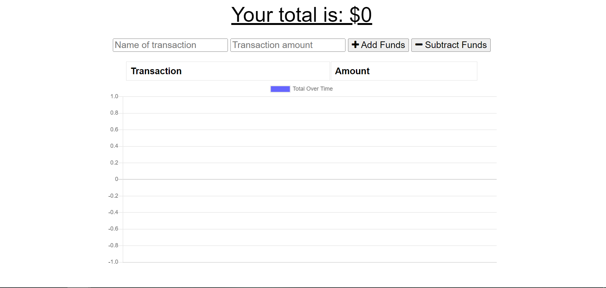

# Budget Tracker

Budget Tracker uses Progressive Web Application (PWA) to enable users to add expenses and deposits to their budget with or without an online connection. Transactions are able to be entered offline and the data populates the total when back online.



## Heroku Deployment 

App Link: https://davonhbbudgettrackerapp.herokuapp.com/

## Installation

Dependencies Required: 
- compression
- express
- mongoose
- morgan


## Deployment

To deploy this project run

```bash
  node server
```


## Authors

- [Davon Brown](https://www.github.com/DavonHB)

